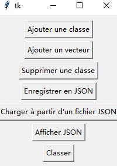
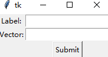
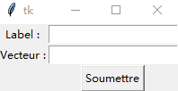
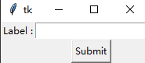
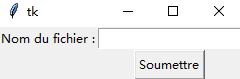
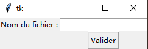
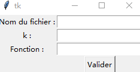

# Utilisation de l'algorithme KNN pour déterminer le type de corpus.
## Description:
Dans ce projet, tout d'abord, dans le fichier "TextProcessing.py", vous allez convertir les documents texte (.txt) de l'ensemble de test ("TestDocuments") en vecteurs TF-IDF et les stocker dans la variable "data" de la classe "KNNClass". Ensuite, vous allez convertir le document texte que l'utilisateur souhaite tester en un vecteur, puis vous allez comparer ce vecteur avec ceux stockés dans "data" en utilisant la méthode KNN. Vous calculerez la distance entre les vecteurs et sélectionnerez les k plus proches pour déterminer le type de document.

## Utilisation：
**Veuillez exécuter le fichier Main.py.**  
Lorsque vous utilisez main.py, vous verrez cette fenêtre.  
  
Une fois que vous verrez cette fenêtre, le programme aura déjà converti les fichiers du dossier TestDocuments en vecteurs et les aura stockés dans KNNClass.data. Par conséquent, avant d'exécuter le code, assurez-vous d'avoir stocké tous les fichiers de l'ensemble de test dans le dossier TestDocuments selon le format (qui sera expliqué dans la structure des fichiers) et de ne pas déplacer ou renommer ce dossier.
1. Ajouter une class  
  Quand vous cliquez sur le bouton "ajouter une classe", vous verrez cette fenêtre.  
    
  Dans la zone de texte "label", vous pouvez saisir le type de fichier (comme roman, poème)(etre sure que label n'existe pas dans KNNClass.data), puis dans la zone "vectors", entrez les vecteurs correspondants pour cette étiquette.  
  Notez que lors de la saisie des vecteurs, vous devez suivre le format suivant :  
    _[  
    { "key_1_1_1": float_1_1_1, "key_1_1_2": float_1_1_2,... },  
    { "key_1_2_1": float_1_2_1, "key_1_2_2": float_1_2_2,... },  
    ...  
    ]_  
  Lorsque vous cliquez sur le bouton "Soumettre", une fenêtre contextuelle s'affichera pour indiquer si la soumission a réussi ou échoué, ainsi que les éventuelles informations d'erreur.(Par exemple, label deja existe.)  
2. Ajouter un vector  
  Quand vous cliquez sur le bouton "ajouter un vector", vous verrez cette fenêtre.  
    
  Dans la zone de texte "label", vous pouvez saisir le type de fichier (comme roman, poème)(etre sure que label existe dans KNNClass.data), puis dans la zone "vectors", entrez le vecteur (seulment un vecteur) correspondants pour cette étiquette.  
  Notez que lors de la saisie des vecteurs, vous devez suivre le format suivant :  
    _{ "key_1_1_1": float_1_1_1, "key_1_1_2": float_1_1_2,... }_  
  Lorsque vous cliquez sur le bouton "Soumettre", une fenêtre contextuelle s'affichera pour indiquer si la soumission a réussi ou échoué, ainsi que les éventuelles informations d'erreur. (Par exemple, label n'existe pas.)
3. Supprimer une classe  
  Quand vous cliquez sur le bouton "supprimer une classe", vous verrez cette fenêtre.  
    
  Dans la zone de texte "label", entrez l'étiquette que vous souhaitez supprimer. **Assurez-vous que l'étiquette que vous avez saisie existe dans KNNClass.data.**  
  Lorsque vous cliquez sur le bouton "Soumettre", une fenêtre contextuelle s'affichera pour indiquer si la suppression a réussi ou échoué, ainsi que les éventuelles informations d'erreur.  
4. Enregistrer en Json  
  Quand vous cliquez sur le bouton "enregistrer en json", vous verrez cette fenêtre.  
    
  Dans la zone de texte "Nom de fichier", vous pouvez saisir le chemin d'accès et le nom de fichier que vous souhaitez enregistrer. **Veuillez noter que l'extension de fichier doit être _.json_.**  
  Lorsque vous cliquez sur le bouton "Soumettre", une fenêtre contextuelle s'affichera pour indiquer si l'enregistrement a réussi ou échoué, ainsi que les éventuelles informations d'erreur (par exemple, si KNNClass.data n'existe pas).  
5. Charger à partir d'un fichier Json  
  Quand vous cliquez sur le bouton "Charger en json", vous verrez cette fenêtre.  
    
  Dans la zone de texte "Nom de fichier", vous pouvez saisir le chemin d'accès et le nom de fichier que vous souhaitez charger. **Veuillez noter que l'extension de fichier doit être _.json_.**  
  Lorsque vous cliquez sur le bouton "Soumettre", une fenêtre contextuelle s'affichera pour indiquer si le chargement a réussi ou échoué, ainsi que les éventuelles informations d'erreur (par exemple, si fichier de JSON n'existe pas).  
6. Afficher JSON  
  Cela imprimera _description_ et _data_ de KNNClass.  
7. Classer  
   Quand vous cliquez sur le bouton "Classer", vous verrez cette fenêtre.  
     
   Dans la zone de texte "nom du fichier", vous devez entrer le chemin d'accès du fichier que vous souhaitez classifier. Assurez-vous que le chemin d'accès est correct.  
   Dans la zone de texte "k", veuillez saisir la valeur de k, c'est-à-dire le nombre de résultats à conserver.  
   Dans la zone de texte "Function", veuillez saisir l'équation de distance que vous souhaitez utiliser. Voici ce qui se passera après que l'utilisateur ait entré une équation :  
      - Si aucun texte n'est entré, la distance de cosinus par défaut sera utilisée.  
      - "e" : entraînera l'utilisation de la distance euclidienne.  
      - "m" : entraînera l'utilisation de la distance de Manhattan.  
      - "p" : entraînera l'utilisation du coefficient de corrélation de Pearson.  
      - Tout autre contenu entraînera l'affichage d'un message d'erreur.  
## La structure de fichier et donnée：
### Dossiers:  
- **Images** : il contient simplement les images utilisées dans les fichiers .md et n'a aucune relation avec le code.  
- **TestDocuments** : c'est l'ensemble de test. Il contient un fichier "description.txt" dont le contenu sera attribué à KNNClass.description. Ne modifiez pas le nom ou ne supprimez pas ce fichier.  
  Les autres fichiers sont des dossiers portant le nom du type de fichier correspondant. Le nom de ces dossiers sera attribué à "label" dans KNNClass.data, et les fichiers de ces dossiers seront convertis en vecteurs et stockés dans le label correspondant de KNNCLass.data.  
  Si vous souhaitez ajouter des fichiers à l'ensemble de test, voici les étapes à suivre :  
    - Si l'étiquette correspondante n'existe pas, vous devez créer un dossier dans TestDocuments et lui donner le nom que vous souhaitez utiliser pour l'étiquette, puis placer les fichiers dans ce dossier.  
    - Si l'étiquette correspondante existe, vous devez placer les fichiers dans le dossier correspondant."  
### "Fichiers :  
- **Main.py** : c'est la class principale qui appelle les fonctions d'autres classes et crée une fenêtre.  
- **TestToVect.py** : c'est la class qui convertit les fichiers texte en vecteurs.  
- **VectDistance.py** : c'est la class qui calcule la distance entre les vecteurs et contient différentes fonctions de calcul de distance.  
- **KNNClasses.py** : c'est la class qui ajoute et supprime des classes et des vecteurs, enregistre et charge des fichiers au format JSON, et effectue une classification.  
  Dans la classe KNNClass, il y a deux variables : "description" et "data".
    - "description" est une chaîne de caractères qui contient le contenu du fichier "description.txt" dans TestDocuments. Il décrit essentiellement l'ensemble de test.
    - "data" est une liste de dictionnaires contenant les clés "label" et "vector". "label" est une chaîne de caractères qui représente le type de document, et "vector" est une liste de dictionnaires contenant les mots et leurs valeurs de tf-idf correspondantes.
    [  
	{  
		"label": "XXX_1",  
		"vectors": [  
			{ "key_1_1_1": float_1_1_1, "key_1_1_2":float_1_1_2,... },  
			{ "key_1_2_1": float_1_2_1, "key_1_2_2":float_1_2_2,... },  
			...  
	},  
	{  
		"label": "XXX_2",  
		"vectors": [  
			{ "key_2_1_1": float_2_1_1, "key_2_1_2":float_2_1_2,... },  
			{ "key_2_2_1": float_2_2_1, "key_2_2_2":float_2_2_2,... },  
			...  
	},  
	...  
]  

- Au bord des falaises.txt : c'est un fichier de test."  
## API:  
### ***Main.py***  
Cet API définit plusieurs fonctions de gestion des événements liés aux différents boutons présents dans l'interface graphique.  
Ces fonctions permettent d'ajouter ou de supprimer des classes, d'ajouter des vecteurs, de sauvegarder et de charger des données au format JSON,  
d'afficher les données JSON et de classifier le document.  
#### on_add_class_click()   
Cette fonction gère le clic sur le bouton "Ajouter une classe".  
Elle crée une nouvelle fenêtre pour saisir les informations de la classe et ajoute la classe avec les informations entrées.  

#### on_add_vector_click()   
Cette fonction gère le clic sur le bouton "Ajouter un vecteur".  
Elle crée une nouvelle fenêtre pour saisir les informations du vecteur et ajoute le vecteur avec les informations entrées.  

#### on_del_class_click()   
Cette fonction gère le clic sur le bouton "Supprimer une classe".  
Elle crée une nouvelle fenêtre pour saisir le nom de la classe à supprimer et supprime la classe avec le nom entré.  

#### on_save_as_json_click()   
Cette fonction gère le clic sur le bouton "Enregistrer en JSON".  
Elle crée une nouvelle fenêtre pour saisir le nom du fichier dans lequel sauvegarder les données et enregistre les données au format JSON avec le nom entré.  

#### on_load_as_json_click()   
Cette fonction gère le clic sur le bouton "Charger à partir d'un fichier JSON".  
Elle crée une nouvelle fenêtre pour saisir le nom du fichier à charger et charge les données à partir du fichier JSON avec le nom entré.  

#### show_json()   
Cette fonction affiche les données JSON dans une nouvelle fenêtre lorsqu'on clique sur le bouton "Afficher JSON".  

#### classify_main()   
Cette fonction gère le clic sur le bouton "Classer".  
Elle crée une nouvelle fenêtre pour saisir les informations nécessaires au processus de classification (nom du fichier, valeur de k, fonction de distance) et affiche les résultats de la classification.  
  
  
### ***KNNClasses***  
Cette classe est un classificateur KNN qui peut être utilisé pour classifier des données représentées par des vecteurs. Il est utilisé pour classifier des vecteurs d'entrée et renvoyer les étiquettes des K vecteurs les plus similaires. Ses méthodes comprennent l'ajout et la suppression de classes, l'ajout de vecteurs à des classes existantes, la sauvegarde de données au format JSON, le chargement de données à partir de fichiers JSON, le calcul de la similarité entre les vecteurs et le renvoi des étiquettes des K vecteurs les plus proches, etc. En outre, il peut produire une représentation JSON des données, et les données de l'objet peuvent être modifiées.  
#### __init__(self, description: str, data: List) -> None  
Description: Initialise une nouvelle instance de la classe KNNClasses.  
Paramètres:  
description (str): Description des données.  
data (List): Liste des classes et de leurs vecteurs.  
#### add_class(self, label: str, vectors: List) -> None  
Description: Ajoute une nouvelle classe à l'objet KNNClasses.  
Paramètres:  
label (str): Nom de la classe.  
vectors (List): Liste des vecteurs associés à la classe.  
#### add_vector(self, label: str, vector: Dict) -> None  
Description: Ajoute un vecteur à une classe existante.  
Paramètres:  
label (str): Nom de la classe à laquelle le vecteur doit être ajouté.  
vector (Dict): Vecteur à ajouter.  
#### del_class(self, label: str) -> None  
Description: Supprime une classe de l'objet KNNClasses.  
Paramètres:  
label (str): Nom de la classe à supprimer.  
#### save_as_json(self, filename: str) -> None  
Description: Sauvegarde les données dans un fichier JSON.  
Paramètres:  
filename (str): Nom du fichier dans lequel sauvegarder les données.  
#### load_as_json(self, filename: str) -> None  
Description: Charge les données à partir d'un fichier JSON.  
Paramètres:  
filename (str): Nom du fichier à partir duquel charger les données.  
#### classify(self, vector: Dict, k: int, sim_func=None) -> List[Tuple[str, float]]  
Description: Classifie un vecteur en utilisant l'algorithme KNN.  
Paramètres:  
vector (Dict): Vecteur à classifier.  
k (int): Nombre de voisins à considérer.  
sim_func (Optional[Callable]): Fonction de similarité à utiliser. Par défaut, utilise la similarité cosinus.  
#### printjson(self) -> str  
Description: Renvoie une représentation sous forme de chaîne de caractères des données de l'objet KNNClasses.  
#### changedata(self, new_data: List) -> None  
Description: Modifie les données de l'objet KNNClasses.  
Paramètres:  
new_data (List): Nouvelles données à utiliser.  
  
  
### ***TestToVect.py***
Cette classe est utilisée pour traiter les données textuelles. Elle contient plusieurs méthodes pour la segmentation, la vectorisation, la lecture de fichiers texte, la filtration des mots et le calcul des valeurs de TF-IDF.    
#### def tokenize(text, tok_grm):  
Tokenise le texte en utilisant l'expression régulière fournie.  
Paramètres :  
text : Le texte à tokeniser (str)  
tok_grm : L'expression régulière à utiliser pour la tokenisation (re.Pattern)  
Retour :  
tokens : Une liste de tokens extraits du texte (list[str])  

#### def vectorise(tokens):  
Crée un dictionnaire de fréquences pour les tokens donnés.  
Paramètres :  
tokens : Liste de tokens à vectoriser (list[str])  
Retour :  
token_freq : Dictionnaire des fréquences des tokens (dict)  

#### def read_texts(dossier_names: list):  
Lit les textes à partir d'une liste de noms de dossiers.  
Paramètres :  
dossier_names : Liste des noms de dossiers contenant les textes (list[str])  
Retour :  
data : Liste de dictionnaires contenant les labels et les vecteurs des textes (list[dict])  

#### def read_text(dossier_name: str):  
Lit un fichier texte et retourne un dictionnaire contenant le label et les vecteurs du texte.  
Paramètres :  
dossier_name : Le nom du dossier contenant le texte (str)  
Retour :  
data : Liste de dictionnaires contenant le label et les vecteurs du texte (list[dict])  

#### def filtrage(stoplist: set, documents, non_hapax):  
Filtrer les documents en fonction de la stoplist et de la fréquence des mots (si non_hapax).  
Paramètres :  
stoplist : Liste des mots à ignorer (set[str])  
documents : Liste des documents à filtrer (list[dict])  
non_hapax : Si True, conserver uniquement les mots dont la fréquence est supérieure à 1 (bool)  
Retour :  
documents_filtre : Liste des documents filtrés (list[dict])  

#### def tf_idf(documents: list) -> list:  
Calcule les scores tf-idf pour les documents donnés.  
Paramètres :  
documents : Liste des documents pour lesquels calculer les scores tf-idf (list[dict])  
Retour :  
documents_new : Liste des documents avec les scores tf-idf (list[dict])  

#### def TestDocument_to_vector(cls) -> list:  
Lit, filtre et calcule les scores tf-idf pour les documents dans le répertoire "./TestDocuments".  
Retour :  
doc_filtres_tfidf : Liste des documents filtrés avec les scores tf-idf (list[dict])  

#### def document_to_vector(cls, filename: str) -> list:    
Lit, filtre et calcule les scores tf-idf pour un document spécifique.  
Paramètres :  
filename : Le nom du fichier contenant le document (str)  
Retour :  
vecteurs  
  
  
### ***VectDistance.py***
#### is_valid_vector(dist) -> bool:
Description: Cette fonction vérifie si un objet donné est un vecteur valide.  
Paramètres: dist (dict) - un objet de type dictionnaire qui représente le vecteur à vérifier.  
Retour: Un booléen qui indique si le vecteur est valide (True) ou non (False).  
#### sim_cosinus(vec1: dict, vec2: dict) -> float:  
Calcule la similarité cosinus entre deux vecteurs représentés par des dictionnaires.  
Paramètres :  
vec1 (dict) : Premier vecteur sous forme de dictionnaire.  
vec2 (dict) : Deuxième vecteur sous forme de dictionnaire.  
Retour :  
float : La similarité cosinus entre les deux vecteurs.  

#### euclidean_distance(vec1: dict, vec2: dict) -> float:  
Calcule la distance euclidienne entre deux vecteurs représentés par des dictionnaires.
Paramètres :  
vec1 (dict) : Premier vecteur sous forme de dictionnaire.  
vec2 (dict) : Deuxième vecteur sous forme de dictionnaire.  
Retour :  
float : La distance euclidienne entre les deux vecteurs.  

#### manhattan_distance(vec1: dict, vec2: dict) -> float:  
Calcule la distance de Manhattan entre deux vecteurs représentés par des dictionnaires.  
Paramètres :  
vec1 (dict) : Premier vecteur sous forme de dictionnaire.  
vec2 (dict) : Deuxième vecteur sous forme de dictionnaire.  
Retour :  
float : La distance de Manhattan entre les deux vecteurs.  

#### pearson_correlation_coefficient(vect1: dict, vect2: dict) -> float:  
Calcule le coefficient de corrélation de Pearson entre deux vecteurs représentés par des dictionnaires.
Paramètres :  
vec1 (dict) : Premier vecteur sous forme de dictionnaire.  
vec2 (dict) : Deuxième vecteur sous forme de dictionnaire.  
Retour :  
float : Le coefficient de corrélation de Pearson entre les deux vecteurs.  

## Améliorations possibles
1. Dans "data", les "vectors" sont simplement une liste avec des "vector", et nous ne savons pas à quelle "Nom de dossier" chaque élément est associé. Cela peut rendre difficile l'analyse des résultats plus en détail.  
2. Pour améliorer l'expérience utilisateur, il serait utile d'ajouter une fonctionnalité qui permet à l'utilisateur de saisir le nom d'un fichier texte, qui sera ensuite converti en vecteur et ajouté à "data".  
3. Le format de "data" est trop rigide, ce qui peut causer des erreurs si le format change. Il est nécessaire d'améliorer l'adaptation du projet au format de "data".  
  
